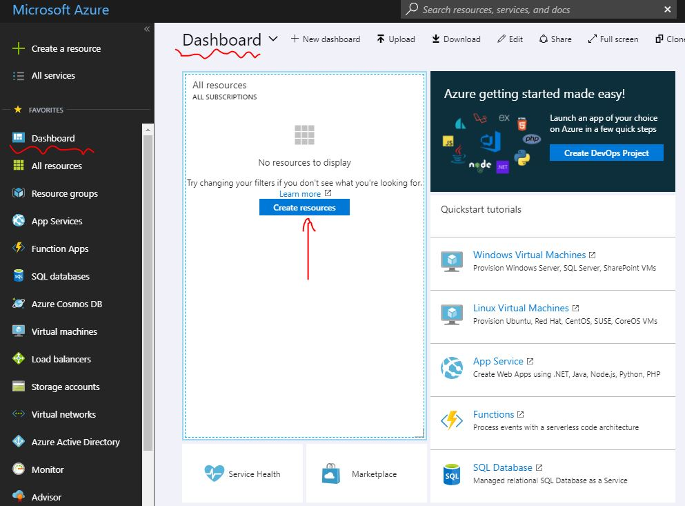
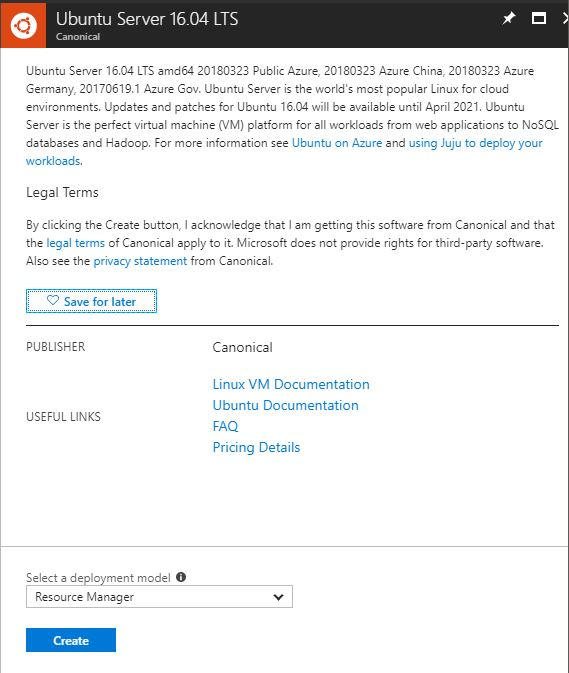

# 1. Create a Ubuntu VM on Azure


Before everything else, you will need to have a Microsoft Azure account which you can setup from [https://azure.microsoft.com](https://azure.microsoft.com) and sign in.


#### From the Dashboard page, click "Create resources" and search "Ubuntu", find 'Ubuntu Server 16.04 LTS' \(Long Term Support\) and click it. This leads to a similar page shown below: 

####  

#### Leave default deployment model as "Resource Manager", click "Create" and configure the basic setting as shown below: 

####  

####  

#### Enter a name you want for your virtual machine \(e.g. Ubuntu16\), and a public key file \(.pub\) in ssh-rsa format. Or you can choose to set a password instead for now.  Pick a  subscription you have \(e.g. Free Trial\), as well as a new or existing Resource group \(this can be used to set rules, polices, e.g. set to open port 80\) and a data-center location you prefer. 

#### Now pick a size that fits the need \(e.g. the Basic B1s - 1GB RAM 4GB Local SSD\): 

#### And configure the optional features, where you can set the Public IP address as Static \(optional\), select "SSH\(22\)" as public inbound ports and leave the rest as default:  

#### In the summary page, review your configuration choices, then click "Create" . Give a minute to Azure to create the VM,  and once it's done you'll see it on your Dashboard. 

